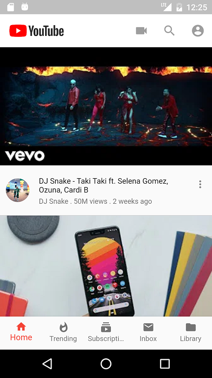
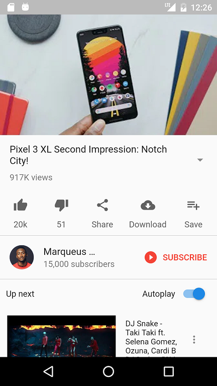
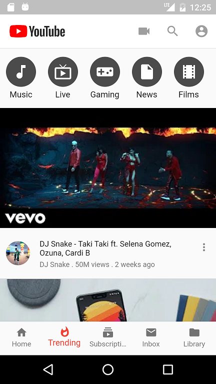
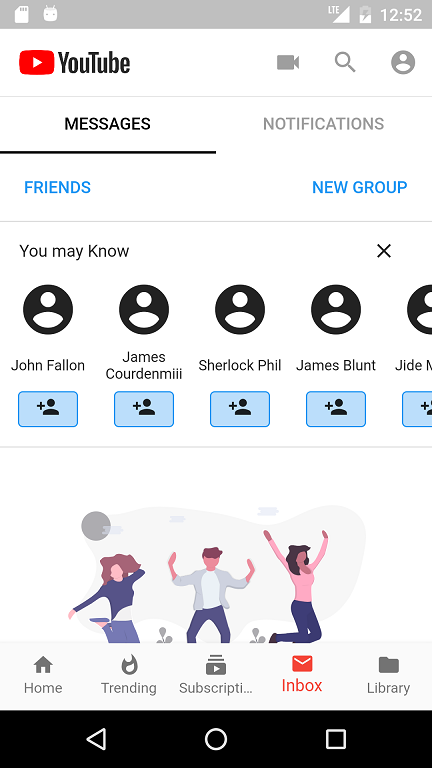
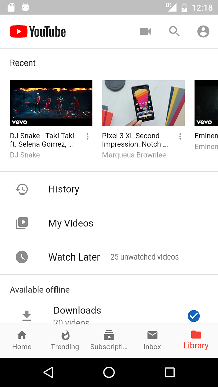
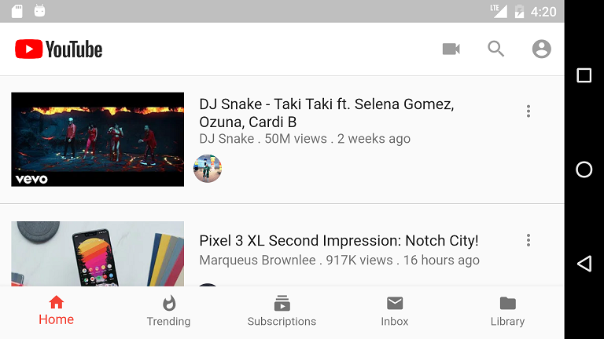

# flutter_youtube_ui

A Flutter application to showcase different UI features of the flutter sdk.

## Screenshots

| |  |  |
| |  | |

## Getting Started

For help getting started with Flutter, view our online
[documentation](https://flutter.io/). and online video Tutorial.
